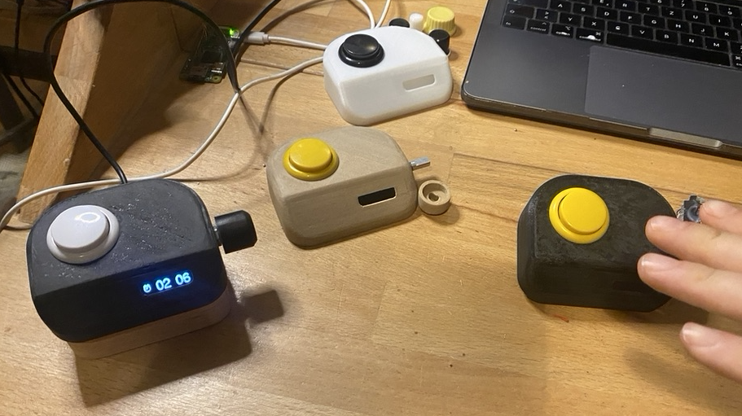
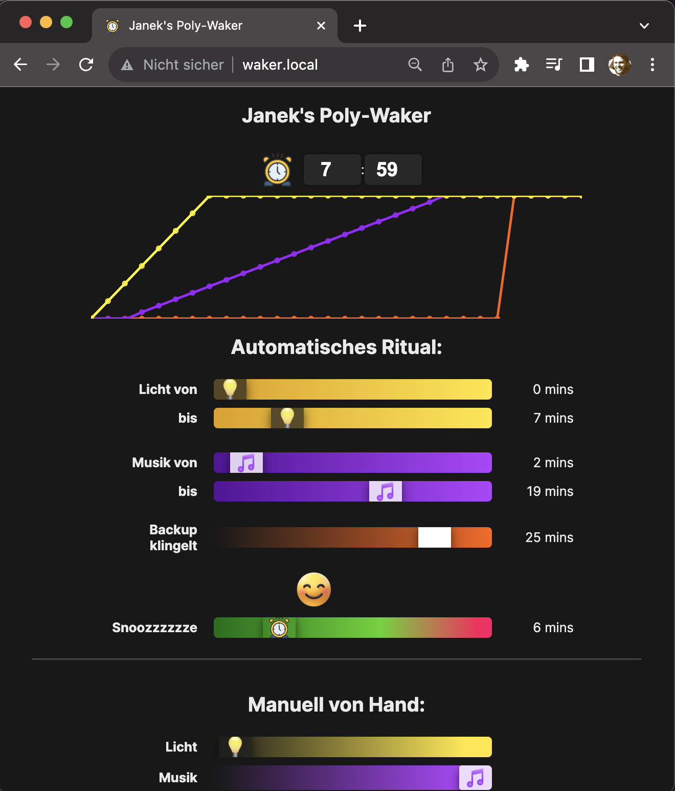
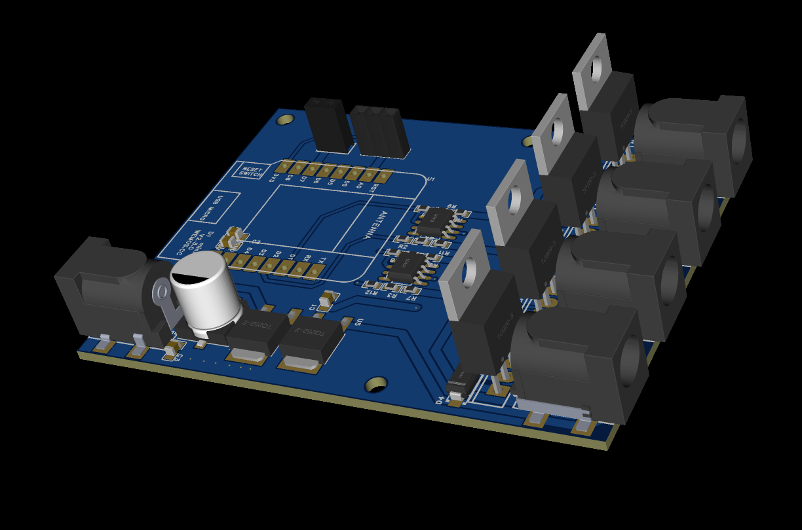
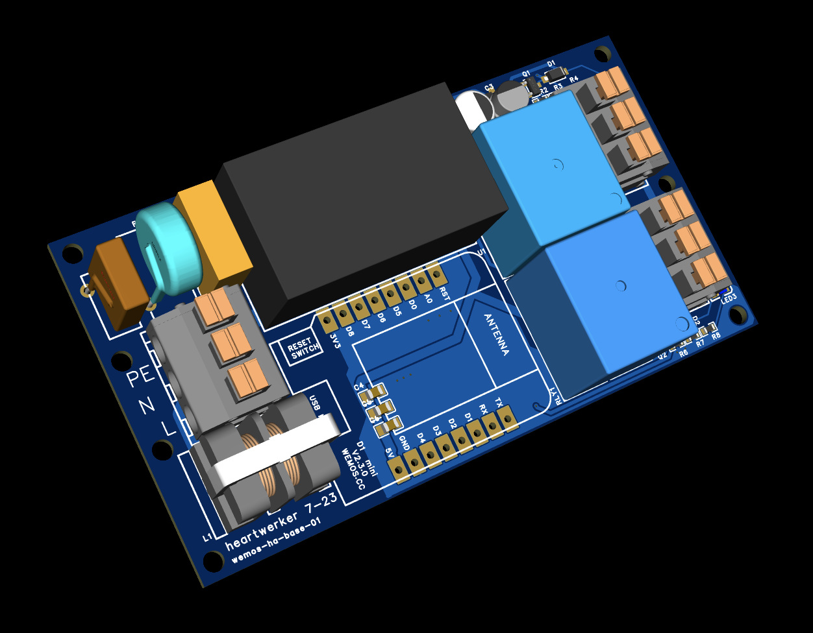

# polywaker  :       

There once was a vision of a lovely friend of ours... She dreamed of awakening with a symphony of sensory experiences woven into a ritual of fading soundscapes, emerging sunlight, and the fine smell of coffee.

This repo realizes this dream and could also help you to realize the custom delightful awakening ritual of your dreams!

## Getting Started

This section will guide you through setting up your development environment and assembling the necessary hardware to bring the Poly-Waker to life.

- Install Visual Studio Code.
- Set up the PlatformIO IDE extension.
- Add the Espressif 32 platform through PlatformIO.
- Utilize these PlatformIO commands:
    - `Build Filesystem Image` (builds the "data" directory)
    - `Upload Filesystem Image`
    - `Build`
    - `Upload`
    - `Monitor` (optional for serial output debugging)

- On first start, the WiFiManager will create a WiFi hotspot to help you configure and connect to your local wifi!

# Software Components
- see [platformio.ini](platformio.ini) for used lib_deps
- Shoutouts to [mo-thunderz](https://github.com/mo-thunderz/Esp32WifiPart4) for ESP32 webserver tutorial
- We're using [chart.js](https://github.com/chartjs/Chart.js), a nifty JavaScript library for crafting graphs. (see license information at the bottom)

# Hardware

To construct your Poly-Waker, you'll need:
- An ESP32-based board (eg. Wemos D1 Mini ESP32)
- A rotary encoder for setting the alarm
- An arcade button for snooze and alarm toggling
- An OLED display for time and alarm status
- Optional: i2s audio and a speaker for a backup alarm sound

#TODO: Add simple Fritzing schematics

# Server

The device hosts a simple HTML server for configuring the wake-up experience from a browser in the same wi-fi.

# Wake Components

##   Music

The soundtrack to your morning comes from a Raspberry Pi configured as a media player and is also running [spotify-alarm-clock](https://github.com/janek/spotify-alarm-clock). Manage it through HTTP requests in your local network:

- `http://raspberry.local:3141/radioplay` - Start the music
- `http://raspberry.local:3141/radiostop` - Stop the music
- `http://raspberry.local:3141/volume?volume=42` - Set the volume

See: src/wake_music.h

##    Light 

Here a simple Wemos D1 / ESP8266 based PCB drives LEDs and controls their brightness. The repository can be found here: [wemos-ha-base/branch-light](https://github.com/heartwerker/wemos-ha-base). Even though the firmware supports and works eg. as a Homekit Accessory and with homeassistant, espnow is implemented on both sides. 
This reduces setup complexity and works as a reliable wireless connection for the poly-waker to communicate the brightness.

See: src/wake_light.h

#TODO: Add a paragraph about the daylight lamp, etc.

##    Coffee 

works similar to Light with esp8266, espnow and a 230v based relay that controls a Bialetti Elletrika. See [wemos-ha-base/branch-coffee](https://github.com/heartwerker/wemos-ha-base)! This coffee machine usually needs to be connected to AC Power first and then requires the button to be pressed but this could probably be hacked by opening the device and soldering a jumper across the tactile switch. It would still automatically turn off. However this is all only highly theoretical of course.

**Caution:** High voltage involved. --> !! Do not attempt without proper knowledge !!

See: src/wake_coffee.h

# Dreams 

- OTA wireless upgrades.
- Integrate scents/smells as a wake-up modality.
- Investigate temperature integration for added comfort.
- 

# Licenses

## Chart.js License

This project uses [chart.js](https://github.com/chartjs/Chart.js), licensed under the MIT License. The full text of the license can be found [here](https://github.com/chartjs/Chart.js/blob/master/LICENSE.md).

## Poly-Waker License

Poly-Waker is licensed under the GNU GPL v3.0. See [LICENSE.txt](LICENSE.txt) for the full license text. This license allows for modification and redistribution under the same terms. More details are available at [www.gnu.org/licenses/gpl-3.0.html](https://www.gnu.org/licenses/gpl-3.0.html).
